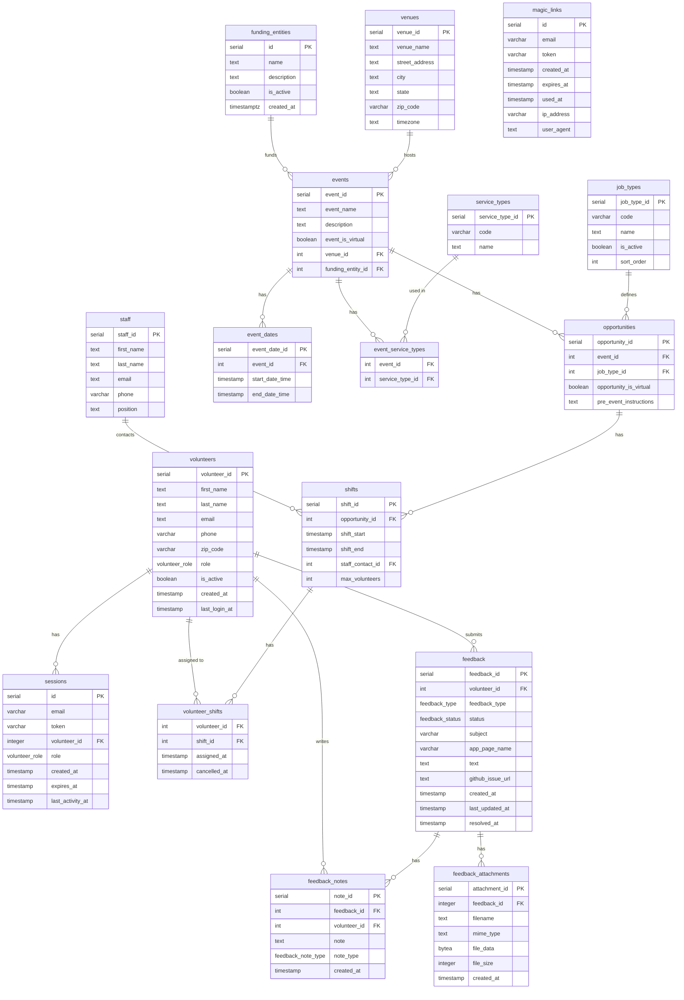

# Database Docker Setup
This information is for the DB administrator.

## Quick Start

### Use Docker-Compose (recommended):

Make sure your have a file in volunteer-scheduler called `secret_postgres_pw.txt` that contains your password. Then use docker-compose:

```bash
docker-compose up -d
```


## volunteer-scheduler ERD


```mermaid
erDiagram
  venues {
    serial venue_id PK
    text venue_name
    text street_address
    text city
    text state
    varchar zip_code
    text timezone
  }
  funding_entities {
    serial id PK
    text name
    text description
    boolean is_active
    timestamptz created_at
  }
  volunteers {
    serial volunteer_id PK
    text first_name
    text last_name
    text email
    varchar phone
    varchar zip_code
    volunteer_role role
    boolean is_active
    timestamp created_at
    timestamp last_login_at
  }
  staff {
    serial staff_id PK
    text first_name
    text last_name
    text email
    varchar phone
    text position
  }
  magic_links {
    serial id PK
    varchar email
    varchar token
    timestamp created_at
    timestamp expires_at
    timestamp used_at
    varchar ip_address
    text user_agent
  }
  sessions {
    serial id PK
    varchar email
    varchar token
    integer volunteer_id FK
    volunteer_role role
    timestamp created_at
    timestamp expires_at
    timestamp last_activity_at
  }
  events {
    serial event_id PK
    text event_name
    text description
    boolean event_is_virtual
    int venue_id FK
    int funding_entity_id FK
  }
  event_dates {
    serial event_date_id PK
    int event_id FK
    timestamp start_date_time
    timestamp end_date_time
  }
  service_types {
    serial service_type_id PK
    varchar code
    text name
  }
  event_service_types {
    int event_id FK
    int service_type_id FK
  }
  job_types {
    serial job_type_id PK
    varchar code
    text name
    boolean is_active
    int sort_order
  }
  opportunities {
    serial opportunity_id PK
    int event_id FK
    int job_type_id FK
    boolean opportunity_is_virtual
    text pre_event_instructions
  }
  shifts {
    serial shift_id PK
    int opportunity_id FK
    timestamp shift_start
    timestamp shift_end
    int staff_contact_id FK
    int max_volunteers
  }
  volunteer_shifts {
    int volunteer_id FK
    int shift_id FK
    timestamp assigned_at
    timestamp cancelled_at
  }
  feedback {
    serial feedback_id PK
    int volunteer_id FK
    feedback_type feedback_type
    feedback_status status
    varchar subject
    varchar app_page_name
    text text
    text github_issue_url
    timestamp created_at
    timestamp last_updated_at
    timestamp resolved_at
  }
  feedback_notes {
    serial note_id PK
    int feedback_id FK
    int volunteer_id FK
    text note
    feedback_note_type note_type
    timestamp created_at
  }
  feedback_attachments {
    serial attachment_id PK
    integer feedback_id FK
    text filename
    text mime_type
    bytea file_data
    integer file_size
    timestamp created_at
  }

  funding_entities ||--o{ events : "funds"
  venues ||--o{ events : "hosts"
  volunteers ||--o{ sessions : "has"
  volunteers ||--o{ volunteer_shifts : "assigned to"
  volunteers ||--o{ feedback : "submits"
  volunteers ||--o{ feedback_notes : "writes"
  staff ||--o{ shifts : "contacts"
  events ||--o{ event_dates : "has"
  events ||--o{ event_service_types : "has"
  service_types ||--o{ event_service_types : "used in"
  events ||--o{ opportunities : "has"
  job_types ||--o{ opportunities : "defines"
  opportunities ||--o{ shifts : "has"
  shifts ||--o{ volunteer_shifts : "has"
  feedback ||--o{ feedback_notes : "has"
  feedback ||--o{ feedback_attachments : "has"
```
### Loading Sample Data

Sample data is not loaded by default. 

If you suspect you have already loaded the DB with sample data, run the trunc.sql script to
remove all of the the data:
```bash
psql -U postgres -d volunteer-scheduler -p 5433 -a -f .\trunc.sql
```

You will be prompted for the postgres user's password.

To load the data, run the script:

```bash
psql -U postgres -d volunteer-scheduler -p 5433 -a -f .\load-sample-data.sql
```

Again, you will be prompted for the postgres user's password.


## Connecting to the Database
```bash

# Connection string
postgresql://postgres@db:5432/volunteer-scheduler

# Using psql
psql -U postgres -d volunteer-scheduler -p 5433

# Inside of the docker image
docker exec -it volunteer-scheduler psql -U postgres -d volunteer-scheduler

```

## Persistence

Data is stored in a Docker volume named `volunteer-scheduler-data`. To backup:
```bash
docker exec volunteer-scheduler pg_dump -U postgres volunteer-scheduler > backup.sql
```

To restore:
```bash
docker exec -i volunteer-scheduler psql -U postgres volunteer-scheduler < backup.sql
```

## Database Migrations

If you want to do database migrations, the files are in `backend/migrations`. You will 
need to either install golang-migrate, or:

```bash
git clone github.com/golang-migrate/migrate/v4
```
The latter is recommended since it will perform the command and then exit.

### Create a new migration:

```bash
migrate create -ext sql -dir migrations -seq migration_name
```

### Apply migrations:

```bash
migrate -database postgresql://postgres@db:5432/volunteer-scheduler -path migrations up
```

### Rollback last migration:

```bash
migrate -database postgresql://postgres@db:5432/volunteer-scheduler -path migrations down 1
```


## Production Deployment

**IMPORTANT**: Change the default password before deploying!
```bash
docker run -d --name volunteer-scheduler -p 5433:5432 -e POSTGRES_PASSWORD=$(openssl rand -base64 32) -v volunteer-scheduler-data:/var/lib/postgresql/data --restart unless-stopped volunteer-scheduler-db
```

