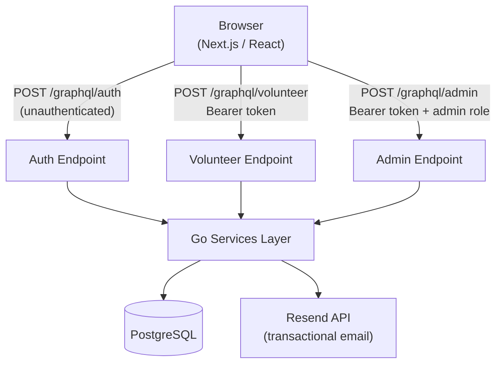

# Architecture

## Overview

The system was designed API-first: the GraphQL schema was defined before any frontend or backend code was written. The database schema followed, designed to support the API. Code was written last.

This order of design — API → database → implementation — ensures the data model serves real use cases rather than being shaped by implementation convenience.

---

## Frontend

**Framework:** Next.js (App Router) with React client components  
**Styling:** CSS Modules  
**API client:** Plain `fetch` with GraphQL queries

### Why plain `fetch` instead of Apollo Client?

Apollo Client provides automatic caching, optimistic updates, and built-in loading/error state management — useful for complex, data-heavy SPAs. For this application, the tradeoffs didn't justify the cost:

- Queries are straightforward request/response with no real-time requirements
- Apollo's normalized cache adds significant complexity when managing mutations and cache invalidation
- Plain `fetch` keeps the bundle small and the code readable to any contributor without Apollo knowledge
- Loading and error states are simple enough to manage with `useState`

### Why Next.js?

Next.js provides file-based routing, built-in optimizations, and a straightforward deployment story, without requiring a separate routing library. The App Router pattern keeps page logic co-located with its UI.

---

## Backend

**Language:** Go  
**API:** GraphQL via [gqlgen](https://gqlgen.com/)  
**Database access:** Standard library `database/sql`

### Why Go?

Go compiles to a single static binary, has excellent performance characteristics for API servers, and enforces a straightforward concurrency model. Its strong typing catches a class of bugs at compile time that dynamic languages surface at runtime. For a developer coming from Python, Go offers a productive learning path while producing a backend that is fast and easy to deploy (the entire server is one binary in a minimal Alpine container).

### Why three separate GraphQL endpoints?

Most GraphQL APIs use a single endpoint and rely on resolver-level authorization checks. This application uses three:

| Endpoint | Caller | Auth required |
|---|---|---|
| `/graphql/auth` | Anyone | None (issues tokens) |
| `/graphql/volunteer` | Logged-in volunteers | Bearer token |
| `/graphql/admin` | Administrators only | Bearer token + `ADMINISTRATOR` role |

Separating the endpoints enforces access control at the network boundary rather than purely in application code. An admin-only mutation simply does not exist on the volunteer endpoint — it cannot be called accidentally or maliciously, regardless of what token is presented.

### Why gqlgen?

gqlgen generates type-safe Go code from the `.graphql` schema files. This means:
- The schema is the single source of truth
- The compiler enforces that every field in the schema has a corresponding resolver
- No runtime reflection or interface{} type assertions in the data layer

---

## Database

**Engine:** PostgreSQL  
**Migrations:** [golang-migrate](https://github.com/golang-migrate/migrate)  
**Normal form:** Third Normal Form (3NF)

The schema is fully normalized to eliminate redundancy and make the relationships between entities explicit. Key design decisions:

- **Venues are reusable** — separated from events so the same physical location can host multiple events without duplicating address data
- **Opportunities are the bridge** — an opportunity links a job type to an event, and shifts hang off opportunities. This allows an event to have multiple distinct volunteer roles, each with their own shift schedule and capacity
- **Assignments are auditable** — the `volunteer_shifts` junction table records both sign-up and cancellation timestamps, providing a lightweight history without a full audit log

See `database/README.md` for the full ERD.

---

## Authentication

**Mechanism:** Magic link (passwordless email)  
**Sessions:** Short-lived JWT tokens stored in `localStorage`

### Why magic links instead of passwords?

- No password storage means no password breach risk
- No password reset flow to build and maintain
- Appropriate for a volunteer-facing application where users may log in infrequently and are unlikely to remember a password

### Why not OAuth (Google, GitHub, etc.)?

OAuth would add a dependency on a third-party identity provider. For an organization deploying this internally, requiring volunteers to have a Google or GitHub account is an unnecessary barrier. Magic links work with any email address.

---

## Deployment

The application is designed to run as Docker containers, making it portable across hosting providers. The live demo runs on [Railway](https://railway.app) with:

- A Next.js frontend container
- A Go backend container  
- A managed PostgreSQL instance
- [Resend](https://resend.com) for transactional email delivery

Environment-specific configuration (API URLs, allowed origins, sender address) is injected via environment variables at build time (for Next.js `NEXT_PUBLIC_` variables) or at runtime (for the Go backend).
